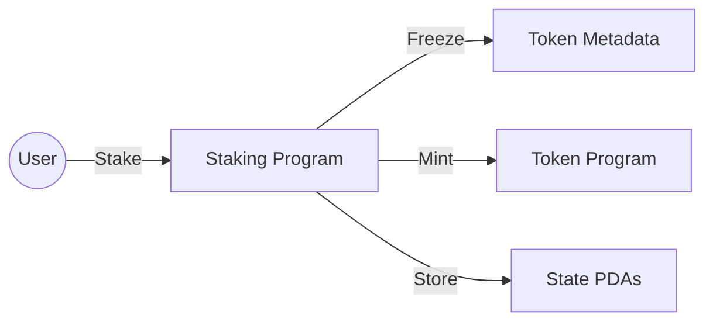
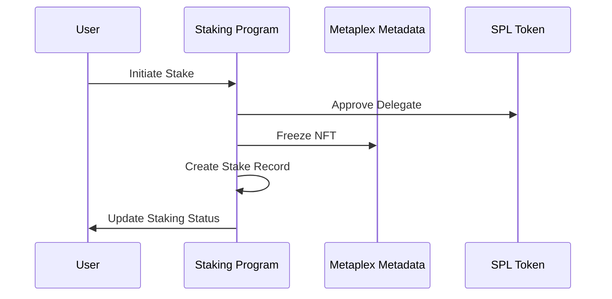
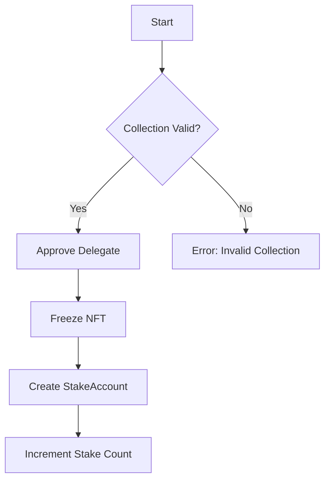
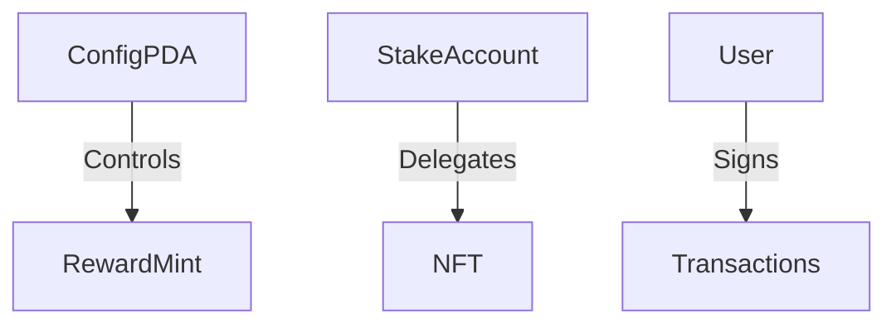
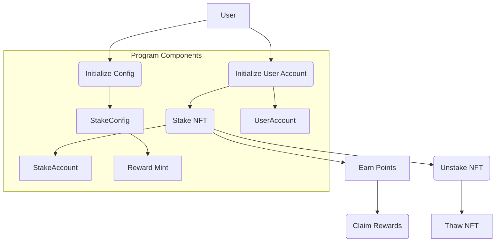
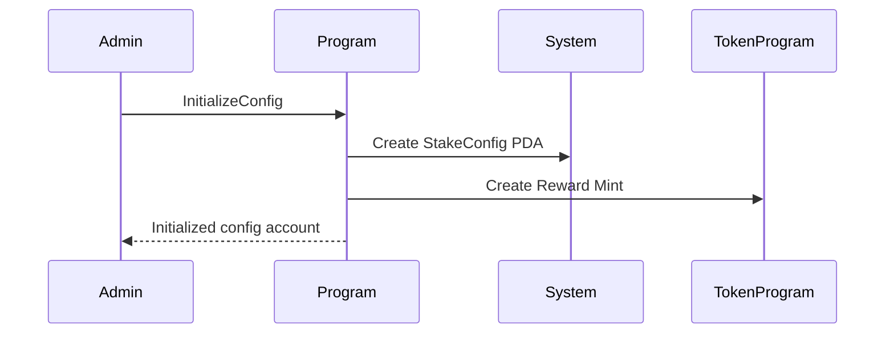
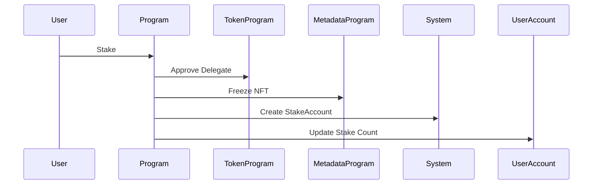
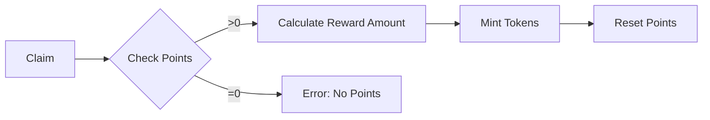

# Solana NFT Staking Program - Technical Readme


## Table of Contents
1. [Protocol Overview](#protocol-overview)
2. [Core Components](#core-components)
3. [State Management](#state-management)
4. [Instruction Workflows](#instruction-workflows)
5. [Security Architecture](#security-architecture)
6. [Token Economics](#token-economics)
7. [Deployment Guide](#deployment-guide)
8. [Testing Framework](#testing-framework)
9. [Audit Considerations](#audit-considerations)

## Protocol Overview <a name="protocol-overview"></a>
A production-grade NFT staking system implementing:
- **Asset Freezing Mechanics** - Immobilize staked NFTs using Metaplex Token Metadata
- **Time-Locked Staking** - Enforce minimum stake durations
- **Reward Distribution** - ERC20-like token minting system
- **Decentralized Governance** - PDA-controlled configuration



## Core Components <a name="core-components"></a>

### 1. State Accounts

#### StakeConfig (Program Authority)
```rust
#[account]
pub struct StakeConfig {
    pub points_per_stake: u8,   // Reward multiplier
    pub max_stake: u8,         // Max NFTs per user (anti-sybil)
    pub freeze_period: u32,    // Minimum stake duration (seconds)
    pub rewards_bump: u8,      // Reward mint PDA verification
    pub bump: u8               // Config PDA verification
}
```

#### UserAccount (User State)
```rust
#[account]
pub struct UserAccount {
    pub points: u32,           // Accumulated reward points
    pub amount_staked: u8,     // Active stake count
    pub bump: u8               // User PDA verification
}
```

#### StakeAccount (NFT Lock Record)
```rust
#[account]
pub struct StakeAccount {
    pub owner: Pubkey,         // Staker wallet address
    pub mint: Pubkey,          // NFT mint address
    pub staked_at: i64,        // Unix timestamp of stake
    pub bump: u8               // Stake record PDA verification
}
```

### 2. Program Interactions


## Instruction Workflows <a name="instruction-workflows"></a>

### 1. Stake Instruction
**Critical Path:**
1. Validate NFT collection
2. Approve token delegation
3. Freeze NFT via CPI
4. Create stake record
5. Update user state



### 2. Unstake Instruction
**Validation Chain:**
1. Verify freeze period completion
2. Thaw NFT via CPI
3. Revoke token delegation
4. Close stake account
5. Update user state

```rust
// Time validation logic
let time_elapsed = (Clock::get()?.unix_timestamp - stake_account.staked_at) / 86400;
require!(time_elapsed >= config.freeze_period, StakeError::FreezePeriodNotPassed);
```

### 3. Claim Rewards
**Minting Process:**
```rust
mint_to(
    cpi_ctx, 
    user_account.points as u64 * 10_u64.pow(reward_mint.decimals as u32)
)?;
```
- Converts points to tokens using mint decimals
- Uses PDA authority for secure minting
- Resets user points post-claim

## Security Architecture <a name="security-architecture"></a>

### 1. Authority Delegation


### 2. Critical Constraints
```rust
// NFT Collection Verification
constraint = metadata.collection.as_ref().unwrap().key == collection_mint.key()
constraint = metadata.collection.as_ref().unwrap().verified == true

// PDA Validation
seeds = [
    b"state", 
    config.key().as_ref(),
    mint.key().as_ref(),
    &[stake_account.bump]
]
```

### 3. Anti-Exploit Measures
- Reentrancy protection through state locks
- Integer overflow guards
- Strict account ownership checks
- Time-based unstaking restrictions

## Token Economics <a name="token-economics"></a>

### Reward Calculation
```
Reward Tokens = Points × 10^(Decimals)
```
**Example:**
- 1000 points
- 6 decimal places
- Reward = 1000 × 10^6 = 1,000,000,000 tokens (1.0 token)

### Mint Configuration
```rust
#[account(
    init,
    payer = admin,
    seeds = [b"rewards", config.key().as_ref()],
    bump,
    mint::decimals = 6,
    mint::authority = config,  // PDA-controlled mint
)]
pub reward_mint: Account<'info, Mint>
```

## Deployment Guide <a name="deployment-guide"></a>

### 1. Environment Setup
```bash
# Install Dependencies
curl --proto '=https' --tlsv1.2 -sSf https://sh.rustup.rs | sh
cargo install anchor-cli
solana-install init 1.10.39

# Build & Deploy
anchor build
anchor deploy --provider.cluster mainnet-beta
```

### 2. Initialization Sequence
```rust
// Initialize Config
initialize_config(
    points_per_stake: 10,
    max_stake: 5,
    freeze_period: 604800  // 7 days
);

// Initialize User
initialize_user_account();
```

A sophisticated NFT staking protocol built on Solana using Anchor framework, implementing:
- NFT freezing mechanics via Token Metadata Program
- Delegated authority management
- Time-locked staking with rewards
- Configurable protocol parameters
- ERC20-like reward distribution

## Key Features <a name="key-features"></a>
- 🛡️ NFT Freezing/Thawing via CPI
- ⏳ Time-based staking constraints
- 🔢 Mathematical reward calculations
- 🔐 PDA-based authority delegation
- 📈 Configurable protocol parameters
- 🧮 Precise decimal handling for rewards
- 🔄 Atomic transaction flows

## Program Architecture <a name="program-architecture"></a>



## State Accounts <a name="state-accounts"></a>

### 1. StakeConfig
```rust
#[account]
pub struct StakeConfig {
    pub points_per_stake: u8,   // Points awarded per staked NFT
    pub max_stake: u8,          // Maximum NFTs user can stake
    pub freeze_period: u32,     // Minimum staking duration (seconds)
    pub rewards_bump: u8,       // PDA bump for reward mint
    pub bump: u8,               // PDA bump for config
}
```

### 2. UserAccount
```rust
#[account]
pub struct UserAccount {
    pub points: u32,            // Accumulated reward points
    pub amount_staked: u8,      // Currently staked NFTs
    pub bump: u8                // PDA bump
}
```

### 3. StakeAccount
```rust
#[account]
pub struct StakeAccount {
    pub owner: Pubkey,          // Staker's public key
    pub mint: Pubkey,           // NFT mint address
    pub staked_at: i64,         // Unix timestamp of stake
    pub bump: u8                // PDA bump
}
```

## Core Instructions <a name="core-instructions"></a>

### 1. initialize_config
**Purpose:** Bootstrap protocol parameters



### 2. initialize_user_account
**Purpose:** User onboarding

```rust
#[derive(Accounts)]
pub struct Initialize<'info>{
    #[account(mut)] pub user: Signer<'info>,
    #[account(init, payer=user, seeds=[b"user", user.key], bump)]
    pub user_account: Account<'info, UserAccount>,
    // ...
}
```

### 3. stake
**Critical Path:**
1. Verify NFT collection
2. Approve token delegate
3. Freeze NFT via CPI
4. Create stake account
5. Update user staking status

```rust
// Freezing logic
FreezeDelegatedAccountCpi::new(
    metadata, 
    FreezeDelegatedAccountCpiAccounts {
        delegate,
        token_account,
        edition,
        mint,
        token_program,
    }
).invoke_signed(signer_seeds)?;
```

### 4. unstake
**Validation Chain:**
1. Check freeze period elapsed
2. Thaw NFT via CPI
3. Revoke delegation
4. Close stake account
5. Update user status

### 5. claim
**Reward Calculation:**
```rust
mint_to(
    cpi_ctx, 
    user_account.points as u64 * 10_u64.pow(reward_mint.decimals as u32)
)?;
```

## Workflow Diagrams <a name="workflow-diagrams"></a>

### Staking Sequence


### Reward Claim Process


## Security Considerations <a name="security-considerations"></a>
1. **Authority Delegation**
   - Strict PDA derivation for mint authority
   - Cross-program signature verification

2. **NFT Validation**
   ```rust
   constraint = metadata.collection.as_ref().unwrap().key == collection_mint.key()
   constraint = metadata.collection.as_ref().unwrap().verified == true
   ```

3. **Time Validation**
   ```rust
   require!(time_elapsed >= config.freeze_period, StakeError::FreezePeriodNotPassed);
   ```

4. **Token Management**
   - Associated Token Account constraints
   - Proper token program CPI usage

## Error Handling <a name="error-handling"></a>
| Error Code | Description                      | Instruction |
|------------|----------------------------------|-------------|
| 0x0        | Maximum stake limit reached      | Stake       |
| 0x1        | Freeze period not elapsed        | Unstake     |
| 0x2        | Invalid NFT collection           | Stake       |


```
## License

MIT License - see [LICENSE.md](LICENSE.md) for details

```